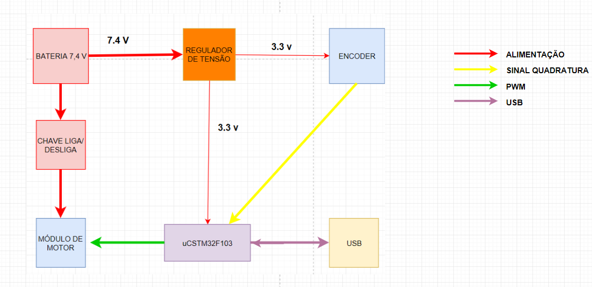
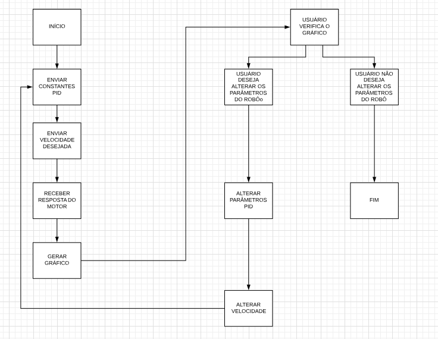
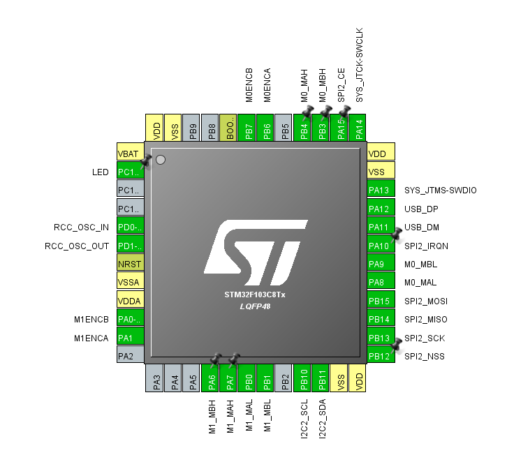
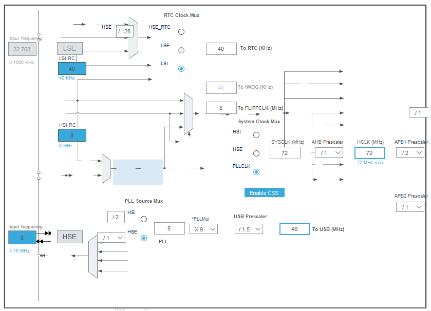

# Efisio

Descrição: Fazer um programa no PC que adquira a resposta do robô a um degrau enviado como velocidade para uma de suas rodas.

Motivação: Melhorar a movimentação dos robôs do projeto de futebol de robôs Very Small Size (VSS), através do cálculo das constantes PID.   
Função: O programa irá enviar uma velocidade para uma das rodas, através da interface USB. Pela mesma interface, o programa irá receber a
velocidade calculada pelo microcontrolador e irá plotar um gráfico que será a resposta do robô a um degrau. Com essa curva gerada, o 
usuário pode extimar as constantes PID do motor.

Fluxograma da Eletrônica:

Fluxograma:

No início do programa, os periféricos são configurados e incicializados conforme a seguinte pinagem do stm32 blue pill:

E a configuração de Clock foi feita da seguinte forma:

Para a interface gráfica, foram pensadas nas seguintes classes:

Diagrama de Classes:

Esboço da interface: usando a interface gráfica do LabVIEW, foi criado um esboço de como ficará o projeto:

No programa, a interface irá enviar os dados de constantes PID e velocidade para determinada roda. Conforme está no programa da commands.cpp, o comando funciona da seguinte forma:

argcg = igual ao número de argumentos que é enviado para o programa. No que que o primeiro argumento deve ser "[A".

arcg==1: enviar pra porta serial os valores atuais de kp ki e kd
argc==2: se o segundo argumento for M1, enviar pra portal serial a velocidade atual da roda do motor M1, se for M0...
argc==3: o segundo argumento vai ser "M1" ou "M0" e o terceiro, o valor de velocidade q deve ser enviado pro respectivo motor
argc==4: os argumentos 2, 3 e 4 devem ser kp ki e kd, respectivamente

Com o comando enviado, a placa irá enviar o comando de pwm para o módulo de motor para o motor executar determinada velocidade. O encoder irá medir a velocidade da roda e a placa executará o controle PID com as constantes definidas pelo LabView. O controle PID funciona da seguinte forma:

E o código que executa isso é o seguinte:

                    pwm_m0 = 300.0f*velocidade_des0 + kp*e_m0 + ki*ierror_m0 + kd*derror_m0;

			speed_saida_0 = pwm_m0*1000;

			pwm_m1 = 300.0f*velocidade_des1 + kp*e_m1 + ki*ierror_m1 + kd*derror_m1;

			speed_saida_1 = pwm_m1*1000;

			pwm_m1=-pwm_m1;

O código foi implementado na seguinte interface, mas o teste não foi filmado:

